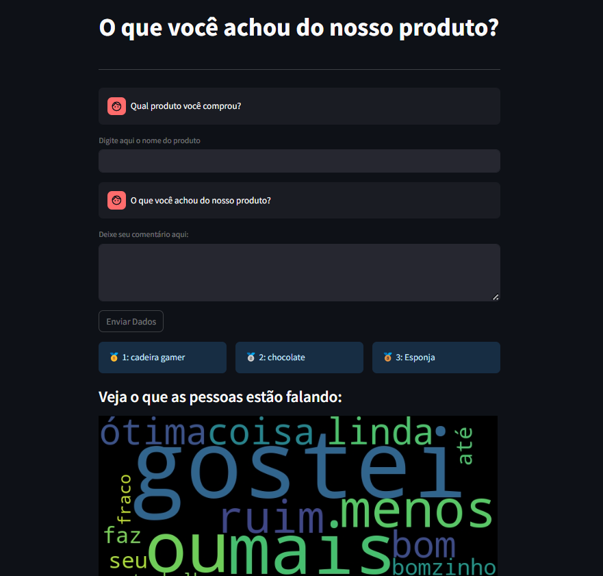

# Olist Sentiment Analysis

<p align="center">
  
</p>

## Descrição do Projeto

Este projeto implementa uma análise de sentimentos para avaliações de produtos da plataforma Olist.
Ele inclui funcionalidades para pré-processamento de dados, treinamento de modelos e previsão de sentimentos.

## Estrutura do Projeto

```
projeto/
└── src/
    ├── config/
    ├── dataset/
    ├── experiments/
    ├── preprocessing/
    ├── saved models/
    ├── pipeline.py
    ├── predict.py
    ├── training_pipeline.py
    └── app.py
└── setup.py
└── MANIFEST.in
└── requirements.txt
```

- **config:** Contém arquivos de configuração para o projeto.
- **dataset:** Contém os dados usados no projeto.
- **experiments:** Contém resultados e registros de experimentos.
- **preprocessing:** Contém scripts para pré-processamento de dados.
- **saved models:** Contém modelos treinados salvos.

## Funcionalidades Principais

- **pipeline.py:** Implementa o pipeline principal do projeto.
- **predict.py:** Implementa a funcionalidade de previsão.
- **training_pipeline.py:** Implementa o pipeline de treinamento do modelo.
- **app.py:** Implementa um web app usando Streamlit para interagir com o modelo de análise de sentimentos.

## Setup

Para configurar o projeto, execute os seguintes comandos:

```bash
python setup.py sdist bdist_wheel
pip install -e .
```

## Como Usar o Web App

1. Clone este repositório para sua máquina local.
2. Navegue até o diretório onde o repositório foi clonado.
3. Instale as dependências do projeto executando o comando `pip install -r requirements.txt`.
4. Execute o web app usando o comando `streamlit run src/app.py`.
5. O web app será aberto em seu navegador padrão.
6. Insira o nome do produto e seu comentário no formulário apresentado.
7. Clique no botão "Enviar Dados" para submeter os dados e visualizar a previsão de sentimento.

## Rodando com Docker

Para rodar o projeto utilizando Docker, siga os passos abaixo:

1. Construa a imagem Docker executando o comando:

   ```bash
   docker build -t olist-nlp:v1 .
   ```

2. Execute o contêiner Docker:

   ```bash
   docker run -it -p 8501:8501 olist-nlp:v1
   ```

3. Acesse a aplicação em seu navegador web em [http://localhost:8501](http://localhost:8501).

## Docker Hub + EC2

Para subir a imagem Docker para o Docker Hub e depois executá-la em uma instância EC2, siga estes passos:

### Subir imagem para o Docker Hub:

1. **Faça login no Docker Hub:**
   ```
   docker login
   ```

2. **Tague a imagem com o nome do seu repositório no Docker Hub:**
   ```
   docker tag olist-nlp:v1 seuusuario/olist-nlp:v1
   ```

   Substitua `seuusuario` pelo seu nome de usuário no Docker Hub.

3. **Envie a imagem para o Docker Hub:**
   ```
   docker push seuusuario/olist-nlp:v1
   ```

### Executar a imagem na EC2:

1. **Crie uma instância EC2:**
   - Acesse o Console de Gerenciamento da AWS e navegue até o serviço EC2.
   - Crie uma nova instância EC2, certificando-se de selecionar uma AMI compatível com Docker.
   - Crie ou selecione uma chave SSH para acessar a instância.

2. **Conecte-se à instância EC2:**
   ```
   ssh -i sua-chave-ssh.pem ec2-user@ip-da-sua-instancia
   ```

   Substitua `sua-chave-ssh.pem` pelo caminho para sua chave SSH e `ip-da-sua-instancia` pelo IP público da sua instância EC2.

3. **Instale o Docker na instância EC2:**
   ```
   sudo yum update -y
   sudo amazon-linux-extras install docker
   sudo service docker start
   ```

4. **Execute a imagem Docker na instância EC2:**
   ```
   docker run -d -p 8501:8501 --name olist-nlp seuusuario/olist-nlp:v1
   ```

   Substitua `seuusuario` pelo seu nome de usuário no Docker Hub.

5. **Verifique se o contêiner está em execução:**
   ```
   docker ps
   ```

   Isso deve exibir o contêiner `olist-nlp` em execução.

6. **Acesse a aplicação:**
   Acesse a aplicação em seu navegador web em `http://ip-da-sua-instancia:8501`.
```